# BorrowBuddy: Project Walkthrough & Teacher Presentation Guide

> [!NOTE]
> All files across the entire **BorrowBuddy** codebase have been fully documented with standardized, summarized, teacher-friendly comments. Every file now contains a **File Header Banner** detailing:
> 1. 🎯 **What this file does**
> 2. 💡 **Key concepts & architecture**
> 3. 🎓 **Teacher Quick Explanation** (the exact 1-2 sentence response you can say aloud when your teacher asks about it)

---

## 🗺️ Master Architecture & File Cheat Sheet

Use this table as your presentation reference. If your teacher points to any file or asks where a feature is implemented, look here:

| File Path | Component / Layer | Key Functions / Exports | What to Say to Your Teacher |
| :--- | :--- | :--- | :--- |
| [`prisma/schema.prisma`](file:///Volumes/NO%20NAME/BorrowBuddy/prisma/schema.prisma) | Database Schema | `User`, `Item`, `Transaction`, `Rating`, `Dispute`, `Message`, `Notification`, `PlatformConfig` | *"This is our relational database schema. We modeled 8 core entities in SQLite with foreign keys and cascading relationships using Prisma ORM."* |
| [`prisma/seed.ts`](file:///Volumes/NO%20NAME/BorrowBuddy/prisma/seed.ts) | Database Seeding | `main()` | *"This script pre-populates SQLite with test students (Arjun, Priya, Rohan), demo equipment (calculators, lab kits), and mock transactions for live evaluation."* |
| [`src/lib/prisma.ts`](file:///Volumes/NO%20NAME/BorrowBuddy/src/lib/prisma.ts) | DB Connection Singleton | `prisma`, `getPrismaClient()` | *"This manages our database connection pool. It uses the singleton pattern on `globalThis` to prevent connection exhaustion during Next.js Hot Module Replacement."* |
| [`src/lib/auth.ts`](file:///Volumes/NO%20NAME/BorrowBuddy/src/lib/auth.ts) | Auth & Security | `signToken()`, `verifyToken()`, `getCurrentUser()` | *"This utility implements stateless JWT authentication. When a student logs in, we digitally sign a tamper-proof JWT token and attach it as a secure HTTP-only cookie."* |
| [`src/lib/simulation.ts`](file:///Volumes/NO%20NAME/BorrowBuddy/src/lib/simulation.ts) | Time Travel Engine | `getSimulatedNow()`, `advanceSimulationHours()`, `resetSimulation()`, `runOverdueAndReminderSweep()` | *"This is our virtual clock engine. It enables fast-forwarding campus time to demonstrate automated overdue alerts and daily 5% late penalties without waiting real days."* |
| [`src/lib/utils.ts`](file:///Volumes/NO%20NAME/BorrowBuddy/src/lib/utils.ts) | Helpers & Constants | `formatINR()`, `formatCustomDate()`, `getStatusBadgeStyle()`, `CATEGORIES`, `CAMPUS_LOCATIONS` | *"This centralizes campus constants (hostels, labs) and helpers for formatting Indian Rupees (₹) and dynamic color-coded status badges."* |
| [`src/app/api/auth/login/route.ts`](file:///Volumes/NO%20NAME/BorrowBuddy/src/app/api/auth/login/route.ts) | Auth API | `POST` | *"Authenticates credentials against salted `bcrypt` hashes, verifies active account status, and issues the signed JWT cookie."* |
| [`src/app/api/auth/register/route.ts`](file:///Volumes/NO%20NAME/BorrowBuddy/src/app/api/auth/register/route.ts) | Signup API | `POST` | *"Enforces campus exclusivity: only students with `@iiitnr.edu.in` emails can sign up. Salts passwords with bcrypt and provisions default 100% trust scores."* |
| [`src/app/api/auth/logout/route.ts`](file:///Volumes/NO%20NAME/BorrowBuddy/src/app/api/auth/logout/route.ts) | Logout API | `POST` | *"Destroys the session by expiring the `campus_session` cookie (`maxAge: 0`) in the user's browser."* |
| [`src/app/api/auth/me/route.ts`](file:///Volumes/NO%20NAME/BorrowBuddy/src/app/api/auth/me/route.ts) | Current User API | `GET` | *"Called by client components to fetch the active student's profile, unread notification count, and current virtual campus time."* |
| [`src/app/api/auth/switch/route.ts`](file:///Volumes/NO%20NAME/BorrowBuddy/src/app/api/auth/switch/route.ts) | Persona Switcher API | `POST` | *"Enables one-click persona switching during presentations to showcase both borrower and lender perspectives seamlessly."* |
| [`src/app/api/items/route.ts`](file:///Volumes/NO%20NAME/BorrowBuddy/src/app/api/items/route.ts) | Marketplace Items API | `GET`, `POST` | *"The `GET` method performs multi-parameter filtering across items; `POST` allows authenticated students to publish new listings."* |
| [`src/app/api/items/[id]/route.ts`](file:///Volumes/NO%20NAME/BorrowBuddy/src/app/api/items/[id]/route.ts) | Single Item API | `GET`, `DELETE` | *"Fetches detailed equipment specs and owner trust metrics; `DELETE` allows the owner or an admin to remove a listing."* |
| [`src/app/api/requests/route.ts`](file:///Volumes/NO%20NAME/BorrowBuddy/src/app/api/requests/route.ts) | Borrow Request API | `POST` | *"Validates borrowing rules (no self-borrowing, availability check, duration limit), logs transaction as `REQUESTED`, and notifies the owner."* |
| [`src/app/api/transactions/route.ts`](file:///Volumes/NO%20NAME/BorrowBuddy/src/app/api/transactions/route.ts) | Transactions API | `GET` | *"Fetches the student's active and past loans, running an automatic overdue calculation sweep prior to returning data."* |
| [`src/app/api/transactions/[id]/accept/route.ts`](file:///Volumes/NO%20NAME/BorrowBuddy/src/app/api/transactions/[id]/accept/route.ts) | Accept Loan API | `POST` | *"Atomic database transaction: marks transaction `ACTIVE`, marks item `BORROWED`, alerts the borrower, and starts the coordination chat."* |
| [`src/app/api/transactions/[id]/reject/route.ts`](file:///Volumes/NO%20NAME/BorrowBuddy/src/app/api/transactions/[id]/reject/route.ts) | Reject Loan API | `POST` | *"Declines a borrow request, sets status to `REJECTED`, and keeps the item listed as available for other peers."* |
| [`src/app/api/transactions/[id]/return/route.ts`](file:///Volumes/NO%20NAME/BorrowBuddy/src/app/api/transactions/[id]/return/route.ts) | Initiate Return API | `POST` | *"Step 1 of return handshake: borrower marks item as handed over (`RETURN_PENDING`), requesting owner verification."* |
| [`src/app/api/transactions/[id]/confirm-return/route.ts`](file:///Volumes/NO%20NAME/BorrowBuddy/src/app/api/transactions/[id]/confirm-return/route.ts) | Confirm Return API | `POST` | *"Step 2 of return handshake: owner confirms physical receipt, status becomes `RETURNED`, item becomes `AVAILABLE`, and ratings unlock."* |
| [`src/app/api/transactions/[id]/dispute/route.ts`](file:///Volumes/NO%20NAME/BorrowBuddy/src/app/api/transactions/[id]/dispute/route.ts) | Raise Dispute API | `POST` | *"Escalates damaged/unreturned equipment: freezes transaction as `DISPUTED` and alerts campus faculty administrators."* |
| [`src/app/api/transactions/[id]/messages/route.ts`](file:///Volumes/NO%20NAME/BorrowBuddy/src/app/api/transactions/[id]/messages/route.ts) | Coordination Chat API | `GET`, `POST` | *"Transaction-scoped messaging enabling private, secure chat between borrower and lender to arrange campus meetups."* |
| [`src/app/api/ratings/route.ts`](file:///Volumes/NO%20NAME/BorrowBuddy/src/app/api/ratings/route.ts) | Peer Ratings API | `POST` | *"Submits 1-5 star reviews, feedback criteria tags, and automatically recalculates the peer's campus reliability score."* |
| [`src/app/api/notifications/route.ts`](file:///Volumes/NO%20NAME/BorrowBuddy/src/app/api/notifications/route.ts) | Notifications API | `GET`, `PATCH` | *"Provides real-time campus inbox feeds and handles mark-as-read updates."* |
| [`src/app/api/simulation/time/route.ts`](file:///Volumes/NO%20NAME/BorrowBuddy/src/app/api/simulation/time/route.ts) | Time Simulation API | `GET`, `POST` | *"Advances or resets virtual campus clock (+1 day, +3 days, Past Deadline) and immediately evaluates overdue penalties."* |
| [`src/app/api/admin/stats/route.ts`](file:///Volumes/NO%20NAME/BorrowBuddy/src/app/api/admin/stats/route.ts) | Admin Metrics API | `GET` | *"Aggregates platform KPIs: total active loans, overdue items, accumulated late fees, open disputes, and average student ratings."* |
| [`src/app/api/admin/users/route.ts`](file:///Volumes/NO%20NAME/BorrowBuddy/src/app/api/admin/users/route.ts) | Admin Users API | `GET`, `PATCH`, `DELETE` | *"Admin directory: inspects student participation, toggles account suspensions (`isSuspended`), or safely deletes accounts."* |
| [`src/app/api/admin/config/route.ts`](file:///Volumes/NO%20NAME/BorrowBuddy/src/app/api/admin/config/route.ts) | Admin Config API | `GET`, `PATCH` | *"Enables faculty administrators to adjust the default daily penalty rate (5%) and maximum fee cap (50%)."* |
| [`src/app/api/admin/disputes/[id]/route.ts`](file:///Volumes/NO%20NAME/BorrowBuddy/src/app/api/admin/disputes/[id]/route.ts) | Dispute Arbitration API | `GET`, `PATCH` | *"Admin arbitration dossier: displays full chat transcripts and allows the administrator to record findings and close the case."* |
| [`src/components/Navbar.tsx`](file:///Volumes/NO%20NAME/BorrowBuddy/src/components/Navbar.tsx) | Navigation Bar | `<Navbar />` | *"Responsive top navigation featuring brand logo, search bar, department category dropdown, unread alerts pill, and theme toggle."* |
| [`src/components/DemoToolbar.tsx`](file:///Volumes/NO%20NAME/BorrowBuddy/src/components/DemoToolbar.tsx) | Presentation Toolbar | `<DemoToolbar />` | *"Evaluator control bar pinned to the top of every page for 1-click persona switching and virtual time-travel testing."* |
| [`src/components/ItemCard.tsx`](file:///Volumes/NO%20NAME/BorrowBuddy/src/components/ItemCard.tsx) | UI Card | `<ItemCard />` | *"Reusable card showing listing photo, condition, campus pickup location, owner trust scores, and pricing badge."* |
| [`src/components/DisputeModal.tsx`](file:///Volumes/NO%20NAME/BorrowBuddy/src/components/DisputeModal.tsx) | Modal Dialog | `<DisputeModal />` | *"Escalation modal allowing students to submit an official grievance to faculty administrators."* |
| [`src/components/RatingModal.tsx`](file:///Volumes/NO%20NAME/BorrowBuddy/src/components/RatingModal.tsx) | Modal Dialog | `<RatingModal />` | *"Interactive 5-star peer feedback dialog with feedback criteria tags and review text."* |
| [`src/components/TransactionChatModal.tsx`](file:///Volumes/NO%20NAME/BorrowBuddy/src/components/TransactionChatModal.tsx) | Chat Dialog | `<TransactionChatModal />` | *"In-app messaging dialog with auto-scrolling and polling to coordinate handovers between students."* |
| [`src/components/ThemeProvider.tsx`](file:///Volumes/NO%20NAME/BorrowBuddy/src/components/ThemeProvider.tsx) | Theme Context | `<ThemeProvider />`, `useTheme()` | *"Context provider persisting Dark/Light mode preferences and avoiding client hydration layout shifts."* |
| [`src/app/layout.tsx`](file:///Volumes/NO%20NAME/BorrowBuddy/src/app/layout.tsx) | Root Layout | `<RootLayout />` | *"Next.js App Router root layout embedding `ThemeProvider`, `DemoToolbar`, `Navbar`, and campus footer."* |
| [`src/app/page.tsx`](file:///Volumes/NO%20NAME/BorrowBuddy/src/app/page.tsx) | Homepage (Server Component) | `<HomePage />` | *"Server-side rendered discovery portal querying SQLite directly for maximum speed and instant statistics."* |
| [`src/app/explore/page.tsx`](file:///Volumes/NO%20NAME/BorrowBuddy/src/app/explore/page.tsx) | Catalog View | `<ExplorePage />` | *"Client-side marketplace view with debounced search, category filters, and URL query parameter synchronization."* |
| [`src/app/items/[id]/page.tsx`](file:///Volumes/NO%20NAME/BorrowBuddy/src/app/items/[id]/page.tsx) | Item Details View | `<ItemDetailPage />` | *"Item specifications view with owner trust dossier, custom interactive calendar picker, and borrow request submission."* |
| [`src/app/items/new/page.tsx`](file:///Volumes/NO%20NAME/BorrowBuddy/src/app/items/new/page.tsx) | Create Listing | `<NewItemPage />` | *"Listing creation form with pre-loaded photo presets, declared value input, and campus pickup location selector."* |
| [`src/app/borrowings/page.tsx`](file:///Volumes/NO%20NAME/BorrowBuddy/src/app/borrowings/page.tsx) | Borrower Dashboard | `<MyBorrowingsPage />` | *"Tracks active loans, overdue countdowns and penalty calculations, return actions, and chat modal triggers."* |
| [`src/app/lent/page.tsx`](file:///Volumes/NO%20NAME/BorrowBuddy/src/app/lent/page.tsx) | Lender Dashboard | `<MyLentItemsPage />` | *"Lender portal to review and accept incoming requests, track active loans, and confirm returned items."* |
| [`src/app/admin/page.tsx`](file:///Volumes/NO%20NAME/BorrowBuddy/src/app/admin/page.tsx) | Admin Dashboard | `<AdminDashboardPage />` | *"Faculty control panel: monitors campus KPIs, moderates inventory, adjusts penalty rules, and suspends bad actors."* |

---

## 🎙️ 5-Minute Teacher Demonstration Flow

When you present to your teacher, follow this step-by-step workflow:

```mermaid
flowchart LR
    A["1. Demo Bar Switch: Arjun"] --> B["2. Explore & Request Item"]
    B --> C["3. Switch: Priya (Lender)"]
    C --> D["4. Accept Request & Chat"]
    D --> E["5. Time Travel: Past Deadline"]
    E --> F["6. Show Overdue & 5% Penalty"]
    F --> G["7. Initiate & Confirm Return"]
    G --> H["8. Submit 5-Star Rating"]
    H --> I["9. Admin Panel: KPI & Moderation"]
```

### Script & Actions:
1. **Introduction & Identity:**
   - *"Good morning Sir/Ma'am. BorrowBuddy is a peer-to-peer campus marketplace designed specifically for IIIT-Naya Raipur students to borrow and rent academic equipment, lab kits, calculators, and electronics safely."*
2. **Step 1: Discover & Request (as Arjun):**
   - Click **Arjun (A)** on the top Demo Bar.
   - Go to **Explore Items** and select **Casio FX-991ES Plus Scientific Calculator**.
   - Point out Priya's 4.9 ⭐ reputation and pickup location (Hostel Raman).
   - Pick a return date on the custom calendar and click **Request to Borrow**.
3. **Step 2: Lender Approval (as Priya):**
   - Click **Priya (B)** on the Demo Bar.
   - Navigate to **Lent Items**.
   - Show the incoming borrow request from Arjun with his trust score. Click **Accept**.
   - Open the **Chat** modal to demonstrate in-app message coordination.
4. **Step 3: Virtual Time-Travel & Overdue Penalty:**
   - Click **Past Deadline** on the Demo Bar.
   - Switch back to **Arjun (A)** and navigate to **My Borrowings**.
   - Show your teacher the color-coded **Overdue Notice** card. Explain:
     *"Sir, because the deadline passed, the platform automatically flagged this transaction as OVERDUE, applied a daily 5% penalty, and sent an alert."*
5. **Step 4: Two-Step Return Handshake & Peer Rating:**
   - In **My Borrowings**, click **Mark as Returned**. Status becomes `RETURN_PENDING`.
   - Switch to **Priya (B)** under **Lent Items** and click **Confirm Return**.
   - Status updates to `RETURNED`, and the item is automatically re-listed as `AVAILABLE`.
   - The **Rating Modal** opens: give a 5-star review with tags (*"Returned On-Time"*). Show how Arjun's average rating updates on his profile!
6. **Step 5: Campus Administration:**
   - Click **🛡️ Admin** on the Demo Bar.
   - Show the **KPI Overview** (total active loans, overdue items, accumulated penalties).
   - Show the **Students** tab and demonstrate how a faculty in-charge can suspend a student account with one click if they violate campus policies.

---

## ❓ Common Viva Questions & Answers

### Q1: "How do you protect user passwords and handle authentication?"
> **Answer:** *"We use stateless JWT (JSON Web Tokens) and bcrypt. When a student registers or logs in, passwords are never stored in plain text; we hash them with a salt factor of 10 using `bcrypt`. Once verified, we digitally sign a JWT containing the student ID and role using `jwt.sign()` and attach it as an HTTP-only cookie (`campus_session`). This cookie cannot be accessed by client-side JavaScript, protecting against XSS attacks."*

### Q2: "How does the overdue penalty algorithm work?"
> **Answer:** *"In `src/lib/simulation.ts`, the function `runOverdueAndReminderSweep()` calculates `diffMs = simulatedNow - deadline`. If `diffMs > 0`, it computes overdue days and applies our daily penalty rate (default 5% per day) against the item's declared replacement value. To ensure fairness, penalties are capped at a maximum safety ceiling (default 50% of the item value) configured in `PlatformConfig`."*

### Q3: "What database did you use and why?"
> **Answer:** *"We used SQLite managed through Prisma ORM. SQLite provides a zero-configuration, ACID-compliant relational database embedded directly in our project repository (`prisma/dev.db`). Prisma provides full TypeScript type-safety, automatic relational queries, and schema migration support."*

### Q4: "What happens if a student damages an item or refuses to return it?"
> **Answer:** *"We built a two-stage protection system. First, our Two-Step Return Handshake prevents borrowers from unilaterally claiming an item was returned—the owner must physically confirm receipt. Second, if there is damage or disagreement, either student can click 'Raise Dispute'. This freezes the transaction as `DISPUTED` and immediately alerts campus faculty administrators on the Admin Dashboard to review chat logs and arbitrate."*

### Q5: "What is the difference between a React Server Component and a Client Component in your project?"
> **Answer:** *"In Next.js App Router, components without `'use client'` (like our `src/app/page.tsx`) are React Server Components. They run exclusively on the Node.js server, allowing us to query our database directly using Prisma without exposing sensitive credentials or downloading unnecessary JavaScript to the client. Interactive UI components (like `Navbar.tsx`, `DemoToolbar.tsx`, and `ItemCard.tsx`) use `'use client'` because they require browser APIs, event listeners, and React hooks like `useState` and `useEffect`."*
